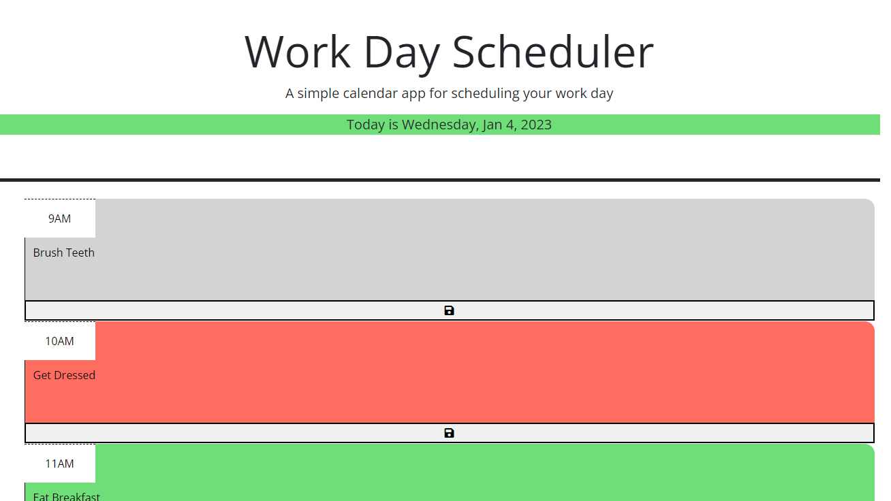

# Week-5-Challenge-Project-Planner

## Description

A website where a user can go to list daily task items in descending chronological order, essentially a digital planner. 

## Installation

N/A

## Usage

Users can enter whatever text they want into the fields next to list of standard workday hours, and these tasks will persist on the page after refreshing. The task boxes will be color-coded based on whether the hour is in the past, present, or future. 

## Credits

Jack Einhorn

## Screenshots

DEPLOYED LINK TO APPLICATION:

https://skullkid4200.github.io/Week-5-Challenge-Project-Planner/

## License

MIT License

Copyright (c) [2023] [Jack Einhorn]

Permission is hereby granted, free of charge, to any person obtaining a copy
of this software and associated documentation files (the "Software"), to deal
in the Software without restriction, including without limitation the rights
to use, copy, modify, merge, publish, distribute, sublicense, and/or sell
copies of the Software, and to permit persons to whom the Software is
furnished to do so, subject to the following conditions:

The above copyright notice and this permission notice shall be included in all
copies or substantial portions of the Software.

THE SOFTWARE IS PROVIDED "AS IS", WITHOUT WARRANTY OF ANY KIND, EXPRESS OR
IMPLIED, INCLUDING BUT NOT LIMITED TO THE WARRANTIES OF MERCHANTABILITY,
FITNESS FOR A PARTICULAR PURPOSE AND NONINFRINGEMENT. IN NO EVENT SHALL THE
AUTHORS OR COPYRIGHT HOLDERS BE LIABLE FOR ANY CLAIM, DAMAGES OR OTHER
LIABILITY, WHETHER IN AN ACTION OF CONTRACT, TORT OR OTHERWISE, ARISING FROM,
OUT OF OR IN CONNECTION WITH THE SOFTWARE OR THE USE OR OTHER DEALINGS IN THE
SOFTWARE.